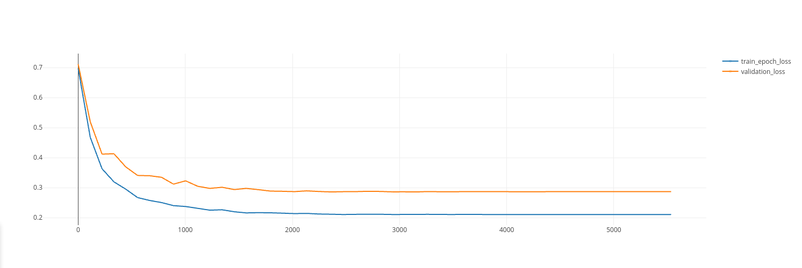
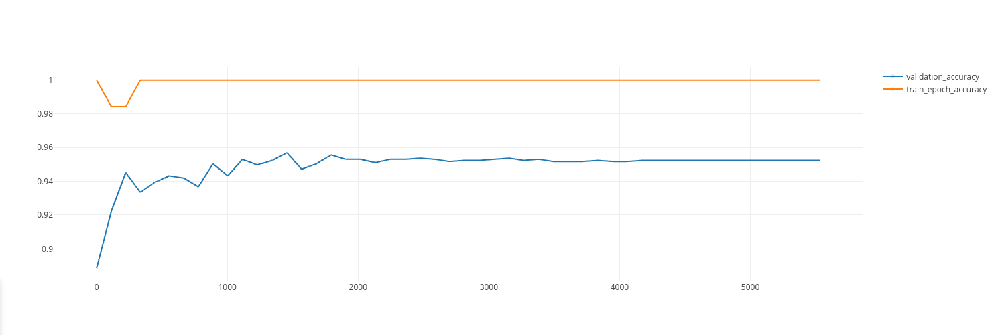

Transformer POS-Tagger:

The POS Tagger is trained on the wikitext-2 dataset slightly preprocessed and tagged with Spacy's UDPOS tagger. You can find `.pickle` files of the train/validation/test targets in the repo.

Below the results from the POS Tagger training:

Word | Tag
----|-----
Sil | NNP
is | VBZ
a | LS
cute | JJ
quirky | JJ
girl | NN
